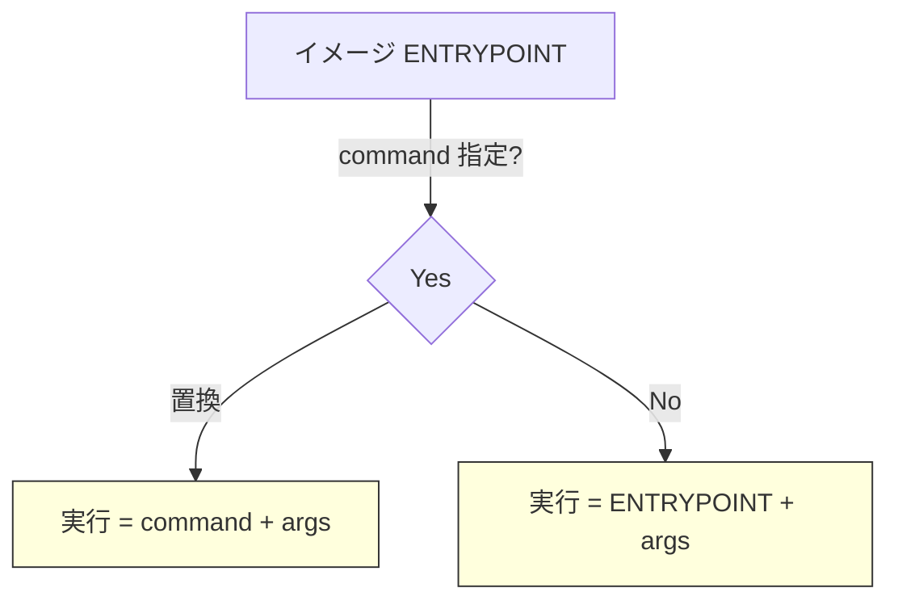

以下に **シェル指定（`/bin/bash` vs `bash`・`/bin/sh` vs `sh`）と
Kubernetes の `command` / `args` の関係** を 1 枚に整理しました。
実務での使い分けが一望できる構成にしています。

---

## 1. シェル指定 — 絶対パスと短縮表記の違い

| 書き方             | 解決方法                            | 利点                                             | 落とし穴・失敗しやすい例                                                        |
| --------------- | ------------------------------- | ---------------------------------------------- | ------------------------------------------------------------------- |
| **`/bin/bash`** | *絶対パス* を直接実行                    | - `PATH` に依存しない<br>- **Bash 機能が確実**            | - Alpine/BusyBox には `/bin/bash` が無い<br>- distroless などシェル不在イメージでは失敗 |
| **`bash`**      | `$PATH` 内を検索 → 最初に見つけた bash を実行 | - パスを短く書ける<br>- `/usr/local/bin/bash` 等でも動く    | - `PATH` を縮小したイメージで解決できず失敗                                          |
| **`/bin/sh`**   | *絶対パス* の POSIX シェル              | - Debian(dash), Alpine(ash) など多数の標準            | - シェル無しイメージでは同様に失敗                                                  |
| **`sh`**        | `$PATH` で `sh` を検索              | - ほぼ全 Linux で成功<br>- CKAD の busybox などでタイピング短縮 | - `PATH` から `/bin` を外した特殊イメージで失敗                                    |

> **実務指針**
>
> * **可搬性重視**: `/bin/sh`（POSIX 準拠・ほぼどこでも有）
> * **Bash 機能必須**: `/bin/bash` を明示
> * **試験/サンプルで短く書きたい**: `sh` で十分
> * **シェル非同梱イメージ**: シェルに頼らずバイナリ直実行（次章へ）

---

## 2. `command` / `args` の上書きルール

| 項目            | Dockerfile に相当 | 役割                        | 上書きのしかた                                  |
| ------------- | -------------- | ------------------------- | ---------------------------------------- |
| **`command`** | `ENTRYPOINT`   | **実行ファイル（＋初期フラグ）** を丸ごと指定 | 書いた瞬間、イメージの ENTRYPOINT を完全に置換            |
| **`args`**    | `CMD`          | 上記実行ファイルに渡す **引数リスト**     | `command` を書かなければイメージ ENTRYPOINT に連結して置換 |

```yaml
# 例：ENTRYPOINT は残し、引数だけ差し替える
args: ["-c","echo from k8s"]
# 例：ENTRYPOINT も自分で決める
command: ["/bin/bash","-c"]
args: ["echo full override"]
```

---

## 3. 早見チャート



---

## 4. 失敗パターンと対応策

| シーン                      | 典型エラー                                     | 対応                                                 |
| ------------------------ | ----------------------------------------- | -------------------------------------------------- |
| distroless で `bash -c`   | `exec: "bash": executable file not found` | ① multi-stage で busybox 追加<br>② シェルを使わず binary 直実行 |
| PATH を短縮したイメージで `sh`     | 同上                                        | `/bin/sh` に変更 or PATH に `/bin` を残す                 |
| Bash 専用文法を `/bin/sh` で実行 | `syntax error: unexpected "("` 等          | `/bin/bash -c` へ切替 or スクリプトを POSIX 準拠に書き直し         |

---

## 5. 実務テンプレ

```yaml
# POSIX シェルで単純ワンライナー
command: ["/bin/sh","-c"]
args: ["while true; do echo ok; sleep 10; done"]

# Bash 機能が必要（配列/正規表現など）
command: ["/bin/bash","-c"]
args: ["for f in *.log; do echo $f; done"]

# シェル非同梱イメージでバイナリ直実行
command: ["/app/server"]
args: ["--port=8080","--log=/tmp/log"]
```

---

### まとめ

| 目的            | シェル指定       | command/args 設定              |
| ------------- | ----------- | ---------------------------- |
| **汎用・安全**     | `/bin/sh`   | ENTRYPOINT を残したい → `args` だけ |
| **Bash 機能**   | `/bin/bash` | `command` と `args` の両方       |
| **最小記述・学習用**  | `sh`        | 省略可                          |
| **シェル無しイメージ** | ―           | `command` でバイナリ直実行           |

これを指針にすれば、イメージや環境が変わっても“動かない”トラブルをかなり減らせます。
