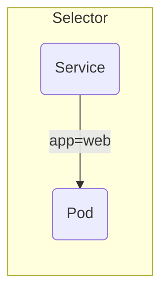

# CKAD Quick Reference — Deduplicated Edition (整理整頓版)

**Killer Shell、KodeKloud、GitHub の練習リポジトリなど対応**

> **目的**: CKAD 本試験 (20 問・120 分) を想定し、**タイムロス最小化** のために必要十分なコマンドと TIPS を 1 シートに凝縮しました。重複していた説明・コマンドを統合し、見出し階層を整理しています。

おっしゃるとおり **“Workloads（Pod／Deployment／ReplicaSet…）が最前線”** で、
Probe・PVC・NetPol・Job は **その次のレイヤ** という整理のほうが実態に合います。
先ほどの「主戦４テーマ」は *「Workload が出来ている前提で＋α」* を意図していましたが、
優先度を改めて 3 階層でまとめ直します。

---

## CKAD 66 % 攻略 優先度ピラミッド

| Tier                      | 必要配点めやす     | 内容                                                                      | 典型タスク                                                                                   | 1 問あたり目標時間  |
| ------------------------- | ----------- | ----------------------------------------------------------------------- | --------------------------------------------------------------------------------------- | ----------- |
| **0️⃣ Core Workloads**    | **35–40 %** | Pod / Deployment / ReplicaSet / Service (ClusterIP・NodePort)            | - `kubectl run` → Probe無しで動作<br>- Deployment へ変換・replicas変更<br>- Service パッチ            | **2–4 min** |
| **1️⃣ 準主戦 (Workload 拡張)** | **25–30 %** | Probe / PVC(+PV) / Job・CronJob / NetworkPolicy **★**                    | - Probe 3 行追加<br>- hostPath PV＋PVC<br>- Job completions／Cron schedule<br>- NP egress 制限 | **3–5 min** |
| **2️⃣ 周辺 (取れれば上積み)**      | 20 % 程度     | ConfigMap / Secret / RBAC / HPA / Ingress / PodDisruptionBudget         | - Secret env / volumeMount<br>- SA 権限 can-i<br>- HPA yaml 1 枚                           | **4–6 min** |
| **3️⃣ 捨てても可**             | 残り          | Helm / Docker・Podman ビルド / NodeAffinity・PriorityClass / StorageClass 作成 | - バンドル問題 or 実務風おまけ                                                                      | **8 min+**  |

> **66 % 合格ライン** ＝ **Tier 0 + Tier 1 を満点近く取ればほぼ到達**
> Tier 2 で 1〜2 題拾えば安全圏。

---

### Tier 0：Core Workloads に必須で覚える 5 コマンド

```bash
# ① Pod 雛形 → 編集で Deployment 化も可
k run podx --image=nginx $do > pod.yaml

# ② Deployment 雛形
k create deploy depx --image=nginx $do > dep.yaml

# ③ Deployment レプリカ変更ワンライナー
k scale deploy depx --replicas=3

# ④ Service (ClusterIP → NodePort)
k expose deploy depx --port 80 --target-port 8080 $do > svc.yaml
kubectl patch svc depx -p '{"spec":{"type":"NodePort","ports":[{"port":80,"nodePort":30100}]}}'

# ⑤ ログ／Describe／イベント確認
k logs -f pod/podx
k describe pod podx
k get events -A | grep -i warning
```

---

### Tier 1：準主戦 4 テーマの最小 YAML 覚え方

| テーマ               | 最小ブロック                                                 |
| ----------------- | ------------------------------------------------------ |
| **Probe**         | readinessProbe3行＋`initialDelaySeconds & periodSeconds` |
| **PVC/PV**        | PV (hostPath, 2 Gi) + PVC (RWO, "" SC) + volumeMount   |
| **Job**           | `{completions:3, parallelism:2, restartPolicy: Never}` |
| **NetworkPolicy** | `policyTypes:["Egress"]` + api podSelector + DNS 53 例外 |

---

## 学習ロードマップ（合格だけ狙う）

1. **Day 1** — *Tier 0* だけで Killer.sh を 1 周
2. **Day 2** — Probe / PVC / Job / NP の雛形を各 5 回手打ち
3. **Day 3** — Killer.sh を S/M/L 戦略で 2 h → 70 % を確認
4. **Day 4** — Tier 2 から 2 テーマ (Secret & HPA) を追加練習
5. **本番** — Tier 0→1 を確実に取り、時間余れば Tier 2 を拾う

---

### まとめ

* **最優先は Tier 0（Workloads 基礎）** — ここが取れなければ何も始まらない
* **Probe / PVC / NetPol / Job は “準主戦”**：Workload 完了後に点を積む場所
* **66 % だけなら Tier 0+1 で足りる** -- 満点を狙うなら Tier 2 以降を拡張

これで “どこに学習時間を割くか” がクリアになるはずです。


## CKAD を **“合格点だけ拾って逃げ切る”** 超実戦メソッド

（90 m 前後で 66 % クリアを狙う）

> 本番 UI（PSI）には -
> *左ペイン*：問題一覧 〔◎未着手／●回答済み／⚑フラグ〕
> *右ペイン*：メモパッド（問題ごとに独立保存）
> があります。ここを徹底的に使い切るのが “タイム勝負” の鍵。

---

### ❶ 5 分で「全題目スキャン ➜ 優先度タグ付け」

| ラベル                      | 目安                         | 例                   | 行動                  |
| ------------------------ | -------------------------- | ------------------- | ------------------- |
| **S (Sure-fire)**        | 単発コマンド／1 リソースだけ            | Q1, Q2, Q6, Q3      | **即着手**             |
| **M (Medium)**           | テンプレ書いて貼り替え                | Q10, Q12, Q14, Q17  | **後でまとめて**          |
| **L (Long / Low value)** | ロールバック調査・ノード操作・Helm・Docker | Q4, Q8, Q11, Q33-35 | **原則捨て**（最後に時間があれば） |

*左ペインの旗アイコンをクリックしながら* S, M, L を可視化。
メモパッド先頭に `S:` `M:` `L:` と列挙すると迷わない。

---

### ❷ S 問（即解ける）を 20–25 分で一気に潰す

1. **名前空間一覧ファイル**（Q1）

   ```bash
   k get ns -o name > ~/namespaces        # 打鍵 5 秒
   ```
2. **Pod/Job テンプレ**（Q2, Q3, Q6）

   * `k run … $do > x.yaml` → probe/labelだけ挿入 → apply
   * 覚えたコピペで “考える時間ゼロ”

**✔️ 目標：ここまでで 6〜8 題、正答率 100 %**

---

### ❸ M 問は「雛形 1 枚 → 3 問まとめ書き」で時短

| 作業ブロック (例)                   | コツ                                             | 想定時間   |
| ---------------------------- | ---------------------------------------------- | ------ |
| Q10 & Q18 **Service/Patch系** | 同じ `kubectl edit`/`patch` パターン                 | 10 min |
| Q12 & Q13 **PV/PVC系**        | 先に PV 作成→PVC で copy-paste                      | 8 min  |
| Q14 **Secret/ConfigMap系**    | `k create secret generic … --from-literal=`    | 3 min  |
| Q16 **サイドカー追加**              | 既存 YAML に `containers: - name: logger-con` を追記 | 4 min  |
| Q17 **InitContainer**        | `spec.initContainers` 雛形をコピペ                   | 3 min  |

メモパッドに以下フォーマットを置き、番号を変えるだけにする：

```yaml
readinessProbe:
  exec:
    command: ["cat","/tmp/ready"]
  initialDelaySeconds: 5
  periodSeconds: 10
```

---

### ❹ 残り時間をチェック

| 状況              | 戦術                                                       |              |
| --------------- | -------------------------------------------------------- | ------------ |
| **> 20 min 残**  | L 問から “最短で終わる” ものを 1〜2 題だけ挑戦（NodePort 変更、ラベル一括 patch など） |              |
| **10–20 min 残** | S/M 問の YAML フィールド typo 検索：\`k get events -A              | grep Error\` |
| **< 10 min**    | フラグ付き未回答を “適当に apply だけ” して何かしらのオブジェクトを作成＝部分点狙い          |              |

---

### ❺ 2 分残しで全ファイル＆状態チェック

```bash
# 全リソース ready？
k get pod -A

# 指定ファイル存在？
ls -l ~/dev/k8s-ckad/wsl/test | grep -E 'namespaces|service_test'
```

---

## よくある落とし穴 → 先にメモ

| 落とし穴                                       | 回避メモ (メモパッドに貼る)                |
| ------------------------------------------ | ------------------------------ |
| `restartPolicy` を Job で忘れ `Never` 以外にすると失格 | `Job/CJは restartPolicy: Never` |
| Probe `command:` 配列忘れ                      | `- cat` `- /tmp/ready` の 2 行   |
| Service `targetPort` タイポ                   | `port`=外部, `targetPort`=Pod    |
| NodePort 範囲外 (30100 OK)                    | 30000–32767                    |
| `storageClassName: ""` を欠くと Bound しない      | 明示的に空文字                        |

---

### 暗記するテンプレ YAML 5 本

1. **Pod** (Probe/command 差し込み)
2. **Deployment** (replicas, securityContext)
3. **Job / CronJob** (completions / schedule)
4. **PVC + PV** (hostPath, retain)
5. **NetworkPolicy egress only**

> ファイル名を `tmpl-pod.yaml` などにしてローカルに置き、
> `cp tmpl-pod.yaml pod6.yaml && sed -i 's/NAME/pod6/' pod6.yaml` の手もあり
> （Killer.sh・本番ともローカルファイル自由）。

---

## まとめ

* **開始 5 分で triage → S/M/L フラグ分け**
* **S を 25 min、M を 35 min** で片付けて 60 min で 70 % 到達。
* **残り時間は typo 修正 or おまけ挑戦**
* **Docker/Helm/NodeAffinity などは最初から捨て問**—時間対効果ゼロ。

これが “合格ライン確保だけに全振り” する CKAD 当日の動き方です。
丸暗記＋フラグ活用で **「解くべき問題」だけ確実に拾いましょう！**


---

## ✅ ブロック一覧と学習順序の目安

| ブロック名            | 中身                                                          | 学ぶ順番の目安                       |
| ---------------- | ----------------------------------------------------------- | ----------------------------- |
| **基本構成ブロック**     | Pod / Deployment / Container / Image / Port / RestartPolicy | **最初** — 骨組み理解                |
| **設定注入ブロック**     | env / envFrom / ConfigMap / Secret / VolumeMount            | **2 番目** — よく出る               |
| **ネットワークブロック**   | Service / Ingress / NetworkPolicy / port-forward            | **3 番目** — 疎通系まとめて            |
| **健康チェックブロック**   | livenessProbe / readinessProbe / startupProbe               | **4 番目** — テンプレ暗記でカバー         |
| **スケジューリングブロック** | Affinity / Toleration / NodeSelector                        | **5 番目** — 必ず 1 問出るレベル        |
| **ロール・認可ブロック**   | ServiceAccount / Role / RoleBinding                         | **6 番目以降** — 難しめ              |
| **運用・変更ブロック**    | rollout / patch / annotate / label                          | CLI 操作訓練に集約                   |
| **ジョブ系ブロック**     | Job / CronJob                                               | 構文忘れがち。試験前復習                  |
| **セキュリティブロック**   | securityContext / runAsNonRoot / fsGroup / capabilities     | 実務で重要。`kubectl explain` とセットで |
| **補助技術**         | kubectl explain / --dry-run / kubectl auth can-i            | 試験中の助け                        |

> **メモ**: CKAD の範囲で問われる *securityContext* は、ほぼ 100 % が **containers** 側の設定です。
>
> *Container 専用項目*: `capabilities`, `privileged`, `readOnlyRootFilesystem`, `allowPrivilegeEscalation`


---

## CKAD 解法メモ（簡易版）

> **範囲限定**: ユーザー指定の代表コマンドのみを抜粋して整理。

---

### 1. 環境変数確認

```
# Pod 内の環境変数をすべて表示
k exec -it <pod> -- env
```

---

### 2. Secret 確認

```
# Key/Value をデコード表示
k get secret <name> -o jsonpath='{.data}' | base64 -d

# Secret の中身 (raw JSON)
k get secret <name> -o json
```

---

### 3. ConfigMap 確認

```
# ConfigMap を YAML で確認
k get cm <name> -o yaml
```

---

### 4. サービス疎通（基本ルート）

1. **ポート番号取得**

   ```
   k get svc
   ```
2. **curl で疎通**

   ```
   curl <service>:<ポート>
   ```

#### 即席 Pod ワンライナー

```
k run tmp --rm -it --restart=Never --image=curlimages/curl:8.8.0 -- http://svc:8080
```

#### 既存 Pod に curl がある場合

```
k exec -it <pod> -- curl -s http://svc:8080
```

---

### 5. Volume マウント確認

```
k exec -it <pod> -- ls /mnt/secret
```

---

### 6. ServiceAccount の権限チェック

```
k auth can-i get pods --as system:serviceaccount:my-ns:sa-name
```

---

> 📝 **使い方**: 上から順にコピペ → 必要箇所 (<pod> や <name>) を置換するだけで即実行。

次におすすめの “細かいところ” ステップ
テーマ	1 行ドリル	失点しやすいポイント
Pod レベルの Probe	startupProbe・livenessProbe の違いを YAML で書き分ける	failureThreshold × periodSeconds の計算忘れ
Volume & Mount	EmptyDir を scratch 領域として使う Job を作成	mountPath と name のタイポ
秘密情報	kubectl create secret generic → Pod で envFrom	Secret を echo -n で Base64 にし忘れ
ConfigMap 差し替え	kubectl create configmap → 再ロードまでの流れ	--from-literal / --from-file の混同
パッチ系コマンド	kubectl patch job ... を —type=merge と strategic で練習	JSONPath の引用 ' / \" 迷子

1 日 2 テーマずつ小さい YAML を打ち込んで kubectl explain で型を確認する──この**“書く→ explain→ apply” のループ**を回せば、試験本番で手が勝手に動きます。
---

## イメージで覚える 3 行まとめ

| キーワード           | イメージ                              | 補足                                                                    |
| --------------- | --------------------------------- | --------------------------------------------------------------------- |
| **Label**       | リソース間を「線でつなぐ名札」                   | Selector で使う                                                          |
| **Annotation**  | 名札の裏に書く「メモ書き／スイッチ」                | Selector で使わない（例: `kubectl.kubernetes.io/restartedAt` → "全 Pod 作り直せ"） |
| **provisioner** | StorageClass が持つ「どの工場でディスク作る？」指示書 | PVC ➜ SC ➜ provisioner ➜ CSI ドライバ ➜ PV                                |

### mermaid 図



---

## 目次

0. [即暗記コマンド 3 選](#即暗記コマンド-3-選)
1. [試験の流れ & マインドセット](#試験の流れ--マインドセット)
2. [環境セットアップ (alias / 補完)](#環境セットアップ-alias--補完)
3. [YAML 生成テンプレ (Imperative→Skeleton)](#yaml-生成テンプレ-imperative→skeleton)
4. [デバッグ 6 ステップ & 便利エイリアス](#デバッグ-6-ステップ--便利エイリアス)
5. [運用系コマンド (更新 / スケール / ロールバック)](#運用系コマンド-更新--スケール--ロールバック)
6. [覚えておくと速いワンライナー集](#覚えておくと速いワンライナー集)
7. [“ドキッ” とするリソース別テンプレ](#ドキッ-とするリソース別テンプレ)
8. [困った時の `kubectl explain` 活用](#困った時の-kubectl-explain-活用)
9. [ネットワーク確認 (Port‑forward & 一時 curl Pod)](#ネットワーク確認-port‑forward--一時-curl-pod)
10. [日々の訓練チェックリスト](#日々の訓練チェックリスト)
11. [`kubectl explain` 早見表 (頻出フィールド)](#kubectl-explain-早見表-頻出フィールド)

---

### 🔥 即暗記コマンド 3 選

```bash
k create deployment nginx --image=nginx $DO > nginx-deploy.yaml
k run busy --image=busybox --restart=Never --command -- sh -c 'sleep 3600' $DO > busy.yaml
k run curl --image=curlimages/curl -it --rm --restart=Never -- sh
while true; do echo "test"; done
```

---

## 試験の流れ & マインドセット

* **開始 3 分**: *alias* & *補完* を設定 → 指の移動距離を削減。
* **設問把握 → Skeleton 生成 → vim で編集**: 得点の 4〜5 割がこの流れ。
* **デバッグ 6 ステップ** を機械的に回し、深追いしない。

---

## 環境セットアップ (alias / 補完)

```bash
# 基本 alias
alias k=kubectl
alias kn='kubectl config set-context --current --namespace'
alias kctx='kubectl config use-context'

# dry‑run 短縮
export DO='--dry-run=client -o yaml'

# bash 補完 (毎回)
source <(kubectl completion bash)
```

💡 `~/.bashrc` に追記すれば次回以降は不要。

---

## YAML 生成テンプレ (Imperative→Skeleton)

```bash
# Deployment / Pod
k create deployment nginx --image=nginx $DO > nginx-deploy.yaml
k run busy --image=busybox --restart=Never --command -- sh -c "sleep 3600 && echo alive" $DO > busy.yaml

# Service (ClusterIP / NodePort / LB)
k expose deployment nginx --port=80 --target-port=8080 $DO > svc.yaml

# Job / CronJob
k create job pi --image=perl -- perl -Mbignum=bpi -wle 'print bpi(2000)' $DO > pi-job.yaml
k create cronjob hello --image=busybox --schedule="*/5 * * * *" -- sh -c 'date; echo Hi' $DO > cj.yaml

# ConfigMap / Secret
k create configmap app-cfg --from-literal=APP_MODE=prod $DO > cm.yaml
k create secret generic db --from-literal=PWD=passw0rd $DO > sec.yaml
```

> `$DO` を毎回付与 → `>` でリダイレクト → **vim 編集** が最速。

---

## デバッグ 6 ステップ & 便利エイリアス

| # | コマンド例                                       | 目的 & 着目点                           |
| - | ------------------------------------------- | ---------------------------------- |
| ① | `k get pods -o wide`                        | **生存/Restart/ノード配置** の俯瞰           |
| ② | `k describe pod <name>`                     | Spec + Conditions + *Events* を一括確認 |
| ③ | `k logs <pod> [-c ctr] [--previous]`        | CrashLoop 時は `--previous`          |
| ④ | `k events --for pod/<name> --types=Warning` | リソース外イベントの拾い漏れ防止                   |
| ⑤ | `k exec -it <pod> -- sh`                    | 内部確認・`curl localhost` 等検証          |
| ⑥ | `k port-forward svc/api 8080:80`            | クラスタ外からエンドポイント疎通                   |

**覚え方:** Get → Describe → Logs → Events → Exec → External Test

```bash
# エイリアス例 (任意)
kgp(){ k get pods -o wide "$@"; }
kd(){ k describe "$@"; }
kll(){ k logs -f "$@"; }
kev(){ k events --for "$@" --types=Warning; }
kex(){ k exec -it "$@" -- sh; }
kpf(){ k port-forward "$@" 8080:80; }
```

---

## 運用系コマンド (更新 / スケール / ロールバック)

| 操作       | コマンド                                        | メモ                          |
| -------- | ------------------------------------------- | --------------------------- |
| イメージ更新   | `k set image deploy/nginx nginx=nginx:1.25` | `k rollout undo` で巻き戻し可     |
| スケール     | `k scale deploy/nginx --replicas=5`         | HPA と混同注意                   |
| ラベル追加    | `k label pod busy tier=backend`             | `--overwrite` で更新           |
| アノテ追加    | `k annotate pod busy owner="$USER"`         | スペース注意                      |
| 直接編集     | `k edit deploy/nginx`                       | vim 保存→即反映                  |
| ロールアウト監視 | `k rollout status deploy/nginx`             | progressDeadlineExceeded 注意 |

---

## 覚えておくと速いワンライナー集

```bash
# ServiceAccount + RoleBinding
k create sa app-sa
k create rolebinding app-rb --clusterrole=view --serviceaccount=default:app-sa

# ノード制御 (Taint / Toleration)
k taint nodes node1 env=prod:NoSchedule   # 追加
k taint nodes node1 env-                  # 削除

# Probe 追加
k set probe deploy/nginx --readiness --get-url=http://:80/healthz

# JSONPatch
k patch deploy nginx -p='[{"op":"replace","path":"/spec/replicas","value":2}]' --type=json
```

---

## “ドキッ” とするリソース別テンプレ

<details>
<summary><strong>7‑1. Liveness / Readiness Probe</strong></summary>

```yaml
spec:
  containers:
  - name: nginx
    image: nginx
    livenessProbe:
      httpGet:
        path: /healthz
        port: 80
      initialDelaySeconds: 5
      periodSeconds: 10
    readinessProbe:
      httpGet:
        path: /
        port: 80
```

</details>

<details>
<summary><strong>7‑2. NodeAffinity / PodAffinity</strong></summary>

```yaml
spec:
  template:
    spec:
      affinity:
        nodeAffinity:
          requiredDuringSchedulingIgnoredDuringExecution:
            nodeSelectorTerms:
            - matchExpressions:
              - key: kubernetes.io/hostname
                operator: In
                values: ["worker-1"]
        podAffinity:
          preferredDuringSchedulingIgnoredDuringExecution:
          - weight: 100
            podAffinityTerm:
              topologyKey: kubernetes.io/hostname
              labelSelector:
                matchLabels:
                  app: frontend
```

</details>

<details>
<summary><strong>7‑3. Taints / Tolerations</strong></summary>

```yaml
spec:
  tolerations:
  - key: key1
    operator: Equal
    value: value1
    effect: NoSchedule
```

</details>

<details>
<summary><strong>7‑4. NetworkPolicy (Ingress & Egress)</strong></summary>

```yaml
spec:
  podSelector:
    matchLabels:
      app: busy
  ingress:
  - from:
    - podSelector:
        matchLabels:
          role: api
  egress:
  - to:
    - ipBlock:
        cidr: 0.0.0.0/0
    ports:
    - protocol: TCP
      port: 443
  policyTypes: ["Ingress", "Egress"]
```

</details>

<details>
<summary><strong>7‑5. StorageClass & PVC</strong></summary>

```yaml
apiVersion: v1
kind: PersistentVolumeClaim
metadata:
  name: data-pvc
spec:
  accessModes: ["ReadWriteOnce"]
  storageClassName: standard
  resources:
    requests:
      storage: 1Gi
```

</details>

<details>
<summary><strong>7‑6. SecurityContext</strong></summary>

```yaml
spec:
  securityContext:
    runAsNonRoot: true
    fsGroup: 2000
  containers:
  - name: busybox
    image: busybox
    securityContext:
      capabilities:
        add: ["NET_ADMIN"]
```

</details>

<details>
<summary><strong>7‑7. ServiceAccount & RoleBinding</strong></summary>

```yaml
apiVersion: v1
kind: ServiceAccount
metadata:
  name: app-sa
---
apiVersion: rbac.authorization.k8s.io/v1
kind: Role
metadata:
  name: view-pods
rules:
- apiGroups: [""]
  resources: ["pods"]
  verbs: ["get", "list", "watch"]
---
apiVersion: rbac.authorization.k8s.io/v1
kind: RoleBinding
metadata:
  name: view-pods-rb
subjects:
- kind: ServiceAccount
  name: app-sa
  namespace: default
roleRef:
  kind: Role
  name: view-pods
  apiGroup: rbac.authorization.k8s.io
```

</details>

---

## 困った時の `kubectl explain` 活用

1. `kubectl explain <path>` で公式リファレンス即参照。
2. Imperative + `$DO` で雛形出力 → vim で差分修正。
3. 補完 (`source <(kubectl completion bash)`) でタイプミス撲滅。

---

## ネットワーク確認 (Port‑forward & 一時 curl Pod)

```bash
# ポートフォワード
k port-forward svc/my-svc 8080:80   # Service 指定
k port-forward pod/my-pod 8080:8080 # Pod 直指定

# 一時 curl Pod
k run curl --image=curlimages/curl -it --rm --restart=Never -- sh
```

---

## 日々の訓練チェックリスト

| 必須アクション                          | 理由                            |
| -------------------------------- | ----------------------------- |
| `k get pods -o wide`             | ノード配置 & Restart 数の把握          |
| `k describe`                     | Spec・Events の確認 (PVC バインド失敗等) |
| `k logs --previous`              | Crash 原因追跡                    |
| `k events --types=Warning`       | Namespace 跨ぎの異常検知             |
| `k get ep` / `k get svc -o yaml` | Service selector ミス検出         |
| `k auth can-i`                   | RBAC の即時確認                    |
| `k exec` / 一時 `curl` Pod         | 修正後の実リクエスト確認                  |

---

## `kubectl explain` 早見表 (頻出フィールド)

| カテゴリ                | フィールド                      | Path 例                                                         |
| ------------------- | -------------------------- | -------------------------------------------------------------- |
| **Security & RBAC** | AllowPrivilegeEscalation   | `pod.spec.containers.securityContext.allowPrivilegeEscalation` |
|                     | Capabilities.add           | `pod.spec.containers.securityContext.capabilities.add`         |
|                     | ServiceAccountName         | `pod.spec.serviceAccountName`                                  |
| **Env & Config**    | Env                        | `pod.spec.containers.env`                                      |
|                     | ConfigMap (Volume)         | `pod.spec.volumes.configMap`                                   |
|                     | ConfigMap (Env)            | `pod.spec.containers.env.valueFrom.configMapKeyRef`            |
|                     | Secret (Volume)            | `pod.spec.volumes.secret`                                      |
|                     | Secret (Env)               | `pod.spec.containers.env.valueFrom.secretKeyRef`               |
| **Health Checks**   | LivenessProbe              | `pod.spec.containers.livenessProbe`                            |
|                     | ReadinessProbe             | `pod.spec.containers.readinessProbe`                           |
|                     | StartupProbe               | `pod.spec.containers.startupProbe`                             |
| **Workloads**       | RollingUpdate              | `deployment.spec.strategy.rollingUpdate`                       |
| **Networking**      | Service.targetPort         | `service.spec.ports.targetPort`                                |
|                     | Service.type               | `service.spec.type`                                            |
|                     | NodePort                   | `service.spec.ports.nodePort`                                  |
|                     | Ingress backend (v1)       | `ingress.spec.rules.http.paths.backend.service`                |
| **NetworkPolicy**   | policyTypes                | `networkpolicy.spec.policyTypes`                               |
|                     | egress                     | `networkpolicy.spec.egress`                                    |
| **Storage**         | PVC.storageClassName       | `pvc.spec.storageClassName`                                    |
|                     | PV.reclaimPolicy           | `persistentvolume.spec.persistentVolumeReclaimPolicy`          |
|                     | StorageClass.reclaimPolicy | `storageclass.reclaimPolicy`                                   |
| **Jobs & CronJobs** | Job.activeDeadlineSeconds  | `job.spec.activeDeadlineSeconds`                               |
|                     | CronJob.history            | `cronjob.spec.successfulJobsHistoryLimit`                      |
| **LimitRange**      | default / defaultRequest   | `limitrange.spec.limits.default`                               |

---

> **TL;DR**
> **Skeleton → vim → apply** と **デバッグ 6 ステップ** が反射で打てれば、CKAD 得点の 80 % を確保できます。
